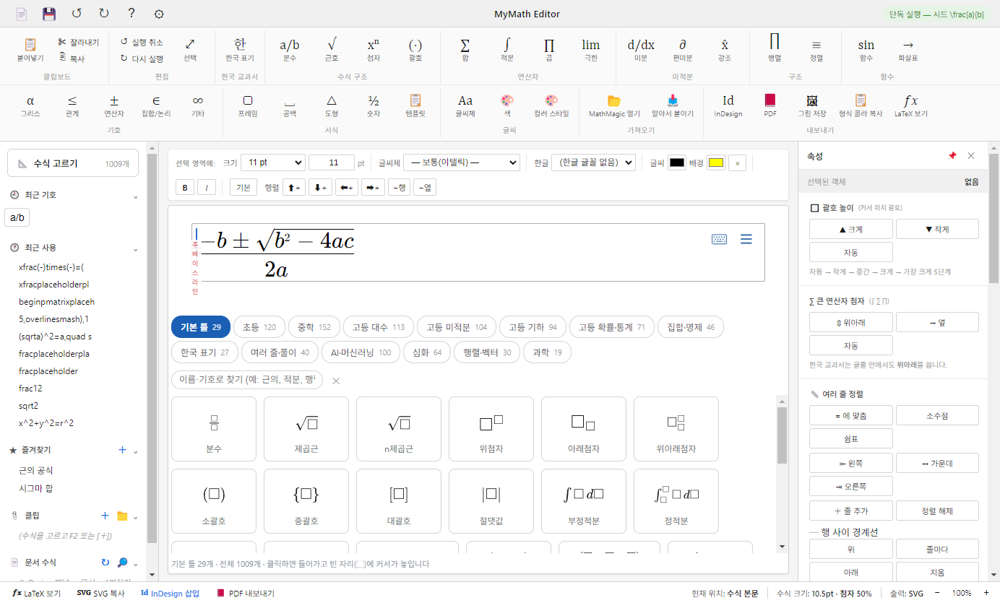
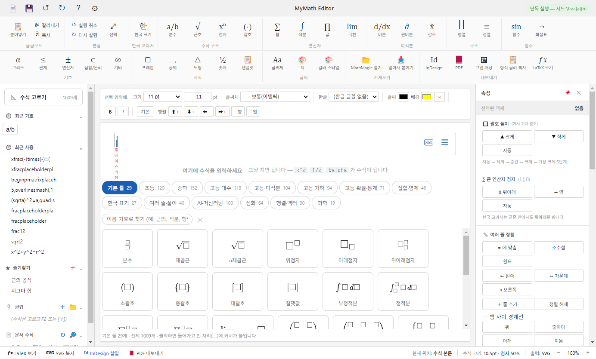
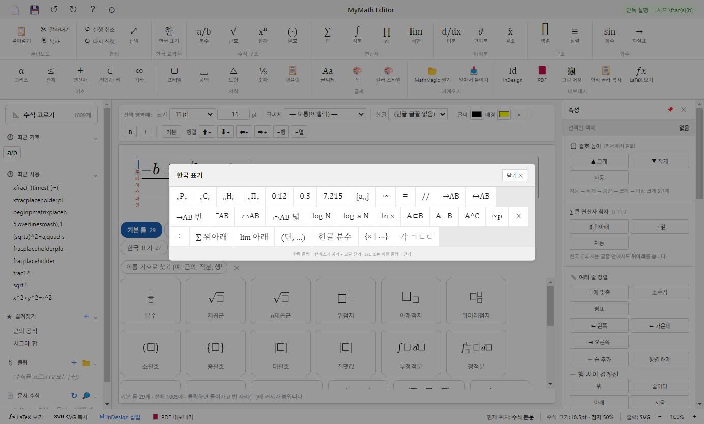

<h1 align="center">MyMath for InDesign</h1>

  <b>InDesign 문서에 수학 수식을 넣고 고치는 무료 도구</b> 
  Free equation tool for Adobe InDesign · <a href="#english">English</a>

  <a href="https://github.com/uibsee/mymath/releases/latest/download/MyMath-Setup.exe"><b>⬇ 무료 다운로드 / Free download</b></a> 
  Windows · 85 MB · InDesign 18.5 (2023년 8월) 이상

수식을 입력하면 인쇄에 안전한 벡터 그래픽으로 InDesign 문서에 들어갑니다.
수식 원본(LaTeX)이 문서 안에 함께 저장되어, 언제든 같은 자리에서 다시 고칠 수 있습니다.

## 설치 — 파일 하나

1. 위의 **[무료 다운로드]** 로 `MyMath-Setup.exe` 를 받아 더블클릭합니다. 편집기와 InDesign 플러그인이 함께 설치됩니다.
   - "Windows의 PC 보호" 창이 뜨면 **[추가 정보] → [실행]** (아직 코드 서명을 하지 않은 무료 프로그램이라 나오는 안내입니다)
2. InDesign을 다시 켜고 메뉴 **[플러그인] → MyMath → MyMath 수식 입력**.
3. 처음 수식을 넣을 때 뜨는 「권한 요청」 창에서 **[내 선택 기억]** 체크 → **[허용]** (한 번만).

따로 설정할 것은 없습니다. 지우려면 Windows 설정 → 앱에서 "MyMath Editor"를 제거하면 플러그인도 함께 지워집니다.

| 필요한 것 | |
|---|---|
| InDesign | **18.5 (2023년 8월) 이상** — 그보다 앞선 버전은 이런 방식의 플러그인 패널을 지원하지 않습니다 |
| 운영체제 | Windows 10 / 11 (Mac은 준비 중) |

## 쓰는 법

| 하고 싶은 것 | 이렇게 |
|---|---|
| 짧은 수식 | 본문에 커서 → 패널 **빠른 넣기 칸**에 `1/2`, `x^2`, `sqrt(2)` → **Enter** |
| 긴 수식 | 패널 **[수식 편집]** → 편집기에서 작성 → **[InDesign]** 버튼 (`Ctrl+S`) |
| 고치기 | 문서의 수식을 클릭 → **[수식 편집]** → 같은 자리에서 바뀝니다 |
| 원고 통째로 | 원고에 `$x^2+1$` 처럼 적어 두고 **[$...$ 수식 변환]** 한 번 |
| 워드·한글 원고 | **[원고 넣기 (워드·한글)]** — `.docx` `.hwpx` 안의 수식까지 한꺼번에 |
| 책 전체 갱신 | **[모든 수식 다시 조판]** — 문서의 수식 전부를 새 설정으로 |

## 특징

- **인쇄 품질** — 벡터 PDF, 검정은 K100 단색 (PDF/X-1a 내보내기로 검증). CMYK·별색·오버프린트 지원
- **수식용 글꼴 설치 불필요** — 글자를 윤곽선으로 그립니다. 인쇄소에 글꼴을 보낼 필요가 없습니다
- **곁에 파일이 안 생깁니다** — 그래픽은 문서에 임베드, 원본 LaTeX은 문서 안에 저장
- **수식 갤러리 1,000여 개** — 초·중·고 교육과정, 여러 줄 풀이, AI·머신러닝 수식. 고르고 고치기만 하면 됩니다
- **글줄 안 세로 정렬 자동** · 본문 글자 크기 자동 반영
- **한국 교과서 표기 팔레트** — 순열 ₙPᵣ, 순환소수, 닮음 ∽, 평행 //, 수식 안 한글
- **가져오기** MathML · AsciiMath · Word 수식 · MediaWiki · 한글 수식 /
  **내보내기** PDF · EPS · SVG · PNG · JPEG · GIF · BMP · WMF · MathML
- **10개 언어** — English · 한국어 · Deutsch · Français · 日本語 · Español · 简体中文 · Português · Italiano · Русский
  (InDesign 언어를 따라가며, 패널에서 바꿀 수 있습니다)

| | |
|---|---|
|  |  |

## 문의 · 오류 신고

[Issues](https://github.com/uibsee/mymath/issues) 에 남겨 주세요. 잘 안 될 때는 패널이 스스로 남기는 기록 파일을 함께 올려 주시면 원인을 빨리 찾을 수 있습니다:
`%APPDATA%\Adobe\UXP\PluginsStorage\IDSN` 아래 `PluginData` 폴더의 `panel-boot.log`

## 라이선스

[MIT](LICENSE). 포함된 라이브러리: [MathLive](https://github.com/arnog/mathlive) (MIT) ·
[MathJax](https://github.com/mathjax/MathJax) (Apache-2.0) · [Electron](https://github.com/electron/electron) (MIT)

Adobe, InDesign은 Adobe Inc.의 상표입니다. 이 프로젝트는 Adobe와 관계가 없습니다.

---

## English

**Free equation tool for Adobe InDesign.** Type an equation and it lands in your document as a print-safe
vector graphic. The LaTeX source is stored inside the document, so you can re-edit in place anytime.

**[⬇ Download MyMath-Setup.exe](https://github.com/uibsee/mymath/releases/latest/download/MyMath-Setup.exe)** —
Windows · 85 MB · requires **InDesign 18.5 (August 2023) or later**

### Install — one file
1. Run `MyMath-Setup.exe`. It installs both the editor and the InDesign plugin.
   If "Windows protected your PC" appears, click **More info → Run anyway** (the app is not code-signed yet).
2. Restart InDesign and choose **Plugins → MyMath**.
3. The first time you place an equation, InDesign asks whether the plugin may launch the editor —
   tick **Remember my choice** and click **Allow** (once only).

Nothing to configure. To remove it, uninstall "MyMath Editor" in Windows Settings → Apps; the plugin goes with it.

### Use
- **Quick insert** — type `1/2`, `x^2`, `sqrt(2)` in the panel and press **Enter**
- **Editor** — **[Edit Equation]** → compose with palettes and a gallery of 1,000+ equations → **[InDesign]** (`Ctrl+S`)
- **Re-edit** — click an equation in the document, then **[Edit Equation]**; it is replaced in the same spot
- **Whole manuscripts** — write `$x^2+1$` in your text and run **[Convert $...$ equations]** once;
  Word (`.docx`) and Hangul (`.hwpx`) manuscripts come in with **[Place manuscript]**, equations included
- **Refresh a book** — **[Re-render all equations]** after changing body size or typesetting settings

### Highlights
K100 vector PDF (verified with PDF/X-1a export), CMYK / spot colour / overprint · glyphs drawn as outlines — no math fonts
to install · graphics embedded, no sidecar files · automatic inline vertical alignment · import MathML, AsciiMath,
Word equations · export PDF, EPS, SVG, PNG and more · 10 UI languages that follow InDesign's language.

### Feedback
Please open an [issue](https://github.com/uibsee/mymath/issues). If something doesn't work, attaching
`panel-boot.log` (in the `PluginData` folder under `%APPDATA%\Adobe\UXP\PluginsStorage\IDSN`) helps a lot.

**License:** [MIT](LICENSE). Bundles MathLive (MIT), MathJax (Apache-2.0), Electron (MIT).
Adobe and InDesign are trademarks of Adobe Inc. This project is not affiliated with Adobe.
