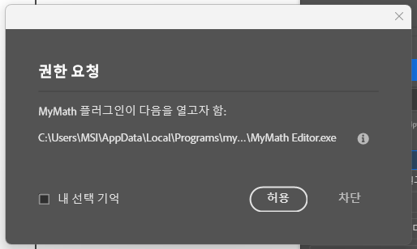

# MyMath 사용설명서

[English](guide.md) · [한국어](guide.ko.md) · [← 프로젝트 첫 화면으로](../README.md)

설치부터 인쇄까지, 필요한 것만 차례대로 적었습니다. 처음이라면 1~3번만 읽어도 바로 쓸 수 있습니다.

## 1. 설치

설치 파일 하나가 편집기와 InDesign 플러그인을 함께 넣습니다. 따로 설정할 것은 없습니다.

1. **설치 파일 실행** — `MyMath-Setup.exe` 를 더블클릭합니다. 묻는 것 없이 설치되고, 끝나면 편집기가 한 번 켜집니다.

   > 💡 **"Windows의 PC 보호"** 창이 뜨면 **[추가 정보] → [실행]**. 아직 코드 서명을 하지 않은 무료 프로그램이라 나오는 안내입니다.

2. **InDesign에서 패널 열기** — InDesign을 다시 켜고 메뉴 **[플러그인] → MyMath → MyMath 수식 입력**. 패널 아래쪽 「통신 설정」의 폴더 칸에 주소가 저절로 잡혀 있으면 준비가 끝난 것입니다.
3. **처음 한 번 — [허용]** — 처음 수식을 넣을 때 InDesign이 편집기 실행을 허락할지 묻습니다. **[내 선택 기억]** 에 체크하고 **[허용]**. 이후로는 묻지 않습니다.

   > Adobe의 보안 확인이며 모든 플러그인에 똑같이 적용됩니다.
   > 

### 필요한 것

- **InDesign 18.5 (2023년 8월) 이상** — 그보다 앞선 버전은 이런 방식의 플러그인 패널을 지원하지 않습니다.
- **Windows 10 / 11** 과 Adobe Creative Cloud 앱 (InDesign을 쓰고 있다면 이미 있습니다).

### 지우기

Windows 설정 → 앱 → "MyMath Editor" 제거. 편집기와 InDesign 플러그인이 함께 지워집니다. 이미 문서에 넣은 수식은 그대로 남고, 그대로 인쇄됩니다.

## 2. 첫 수식 — 10초

가장 짧은 길은 패널의 「빠른 넣기」 칸입니다. 창을 바꿀 필요가 없습니다.

1. **글상자에 커서를 둔다** — 수식이 들어갈 자리를 텍스트 도구로 클릭합니다.
2. **빠른 넣기 칸에 친다** — `1/2`, `x^2`, `sqrt(2)`, `(a+b)/(c+d)` 처럼 보이는 대로 쳐도 되고, LaTeX(`\frac{a}{b}`)로 쳐도 됩니다.
3. **Enter** — 편집기가 뒤에서 그려서 커서 자리에 넣습니다. 본문 글자 크기에 맞춰지고 세로 위치도 자동으로 잡힙니다.

## 3. 편집기로 만들기

긴 수식은 패널의 **[수식 편집]** 으로 편집기를 엽니다. 다 만들면 편집기의 **[InDesign]** 버튼(또는 <kbd>Ctrl</kbd>+<kbd>S</kbd>) — 커서 자리에 들어갑니다.

### 가장 빠른 방법 — 고르고 고치기

캔버스 아래 **수식 갤러리**에 1,000여 개가 실제 모양으로 준비되어 있습니다. 비슷한 것을 클릭하면 캔버스에 들어오고, 빈 자리(⬚)에 커서가 갑니다. 숫자와 문자만 바꾸면 됩니다.

### 직접 만들기

- **그냥 타이핑** — `x^2`, `1/2` 가 바로 수식이 됩니다.
- **리본** — 분수·근호·적분·행렬·괄호 등 갈래별 팔레트. 행렬은 크기를 정하는 마법사가 뜹니다.
- <kbd>Ctrl</kbd>+<kbd>/</kbd> — **기호 검색**. "근호", "적분", "순열" 같은 이름으로 찾습니다.
- <kbd>Ctrl</kbd>+<kbd>G</kbd> 다음 글자 — **그리스 문자** (G → γ, Shift+G → Γ). 한글 자판 상태에서도 됩니다.
- <kbd>Enter</kbd> — **줄 추가** (여러 줄 수식). 속성 패널의 [= 에 맞춤]으로 등호를 세로로 맞춥니다.
- <kbd>Ctrl</kbd>+<kbd>Shift</kbd>+<kbd>V</kbd> — **알아서 붙이기**. 워드 수식·MathML·AsciiMath·LaTeX을 형식을 가려서 붙입니다.

### 자주 쓰는 것 모아 두기

왼쪽 사이드바의 **최근 사용·즐겨찾기·클립**. 클립은 이름 붙여 파일로 저장되므로(`문서\MyMath\Clips`) 폴더째 동료와 나눌 수 있습니다.

## 4. 수식 고치기

수식 원본이 문서 안에 저장되어 있어서, 언제든 같은 자리에서 고칩니다.

1. **문서에서 수식을 클릭해 고른다** — 선택 도구로 클릭합니다. 패널에 그 수식의 내용과 크기가 표시됩니다.
2. **[수식 편집]** — 편집기가 그 수식을 담은 채 열립니다.
3. **고치고 [InDesign]** — 같은 자리의 수식이 새것으로 바뀌고, 뒤 문장은 자연스럽게 밀립니다.

## 5. 원고 통째로

수식이 수백 개인 책을 하나씩 넣을 필요가 없습니다.

### $…$ 로 적어 둔 원고

원고의 수식 자리를 `$x^2+1$` 처럼 글자로 적어 InDesign에 흘린 뒤, 패널 「문서」의 **[$...$ 수식 변환]** 을 한 번 누릅니다. 문서의 모든 `$…$` 가 수식 그래픽으로 바뀝니다. 진짜 달러 기호는 `\$` 로 적으면 건너뜁니다.

### 워드·한글 원고

글상자에 커서를 두고 **[원고 넣기 (워드·한글)]** → `.docx` 또는 `.hwpx` 파일을 고릅니다. 본문이 흘러 들어오고, 원고 안의 수식까지 자동으로 그래픽이 됩니다. 옛 `.hwp` 는 한글에서 HWPX로 다시 저장해 주세요.

### 범위

패널의 **[범위: 문서 전체 / 선택 글상자]** 로 작업 대상을 정합니다. 한 장(章)만 바꾸고 싶을 때 씁니다.

## 6. 문서 전체 다루기

| | |
|---|---|
| **모든 수식 다시 조판** | 본문 크기나 조판 설정(첨자 비율·선 두께·색)을 바꾼 뒤 누르면 문서의 수식 전부가 새 설정으로 바뀝니다. 옆의 크기 칸에서 크기를 하나로 통일할 수도 있습니다. |
| **수식 목록 보내기** | 문서의 모든 수식이 편집기 사이드바 「문서 수식」에 쪽 번호와 함께 뜹니다. 클릭하면 그 수식을 바로 고칩니다. 🔍 **검수**는 오타(그려지지 않는 명령)·빈 자리·중복을 찾아 줍니다 — 교정 단계에 쓰세요. |
| **수식 개수 세기** | "수식 128개 · 34쪽에 걸쳐 있음" 처럼 바로 알려 줍니다. |
| **내보내기** | CSV(쪽·내용·크기 목록), SVG, PNG. 웹이나 발표 자료에 같은 수식을 쓸 때. |

## 7. 세로 위치

글줄 안 수식은 본문 글자의 세로 중심에 자동으로 맞춰집니다. 손댈 일이 드뭅니다.

특정 수식만 조금 올리거나 내리고 싶다면: 그 수식을 고르고 패널 「세로 보정」의 **▲ ▼**. 한 번에 움직이는 양은 옆의 드롭다운(0.05~1pt)에서 정합니다. **[0]** 은 자동 위치로 되돌립니다. 이 조정은 고른 수식에만 적용되고, 이후 넣는 수식에는 영향이 없습니다.

## 8. 인쇄 품질

- 수식은 **벡터 PDF**로 들어갑니다. 아무리 확대해도 깨지지 않습니다.
- 검정은 **K100 단색**입니다. 4색으로 섞인 검정이 아니어서 분판에서 검정 판 하나에만 찍힙니다. PDF/X-1a 내보내기로 확인했습니다.
- 글자를 **윤곽선**으로 그리므로 수식용 글꼴을 설치하거나 인쇄소에 보낼 필요가 없습니다.
- 수식 그래픽은 문서에 **임베드**됩니다. 곁에 링크 파일이 생기지 않아 "누락된 링크"가 없습니다.
- 편집기 환경설정(<kbd>Ctrl</kbd>+<kbd>;</kbd>)의 「인쇄 색」에서 CMYK 직접 지정·**별색**·**오버프린트**를 고를 수 있습니다. 기본값(K100)이 대부분의 책에 맞습니다.

## 9. 언어

패널과 편집기는 **InDesign의 언어를 따라갑니다**. 다르게 쓰고 싶다면 패널 「통신 설정」 맨 아래의 **언어**에서 고르세요 — 패널은 바로, 편집기도 함께 바뀝니다. 편집기만 따로 바꾸려면 편집기 메뉴 **보기 → 언어**. 지원 언어: English · 한국어 · Deutsch · Français · 日本語 · Español · 简体中文 · Português · Italiano · Русский.

## 10. 문제가 생기면

**[플러그인] 메뉴에 MyMath가 없어요**

InDesign 버전이 18.5 이상인지 확인하고(도움말 → InDesign 정보), InDesign을 완전히 껐다 켜 보세요. 설치할 때 "플러그인을 넣지 못했습니다"라는 창이 떴다면 설치 파일을 한 번 더 실행하면 됩니다.

**[수식 편집]을 눌러도 편집기가 안 떠요**

처음 뜨는 「권한 요청」 창에서 [차단]을 눌렀을 수 있습니다. 바탕화면의 **MyMath Editor** 를 직접 켜 두면 패널이 곧바로 연결합니다 — 편집기를 켜 둔 채 쓰는 것이 가장 빠르기도 합니다.

**수식을 넣었더니 본문 글자가 안 보여요**

패널 「문서」의 **[화면 새로 그림]** 을 누르세요. 화면 표시만의 문제이며 문서 내용은 그대로입니다.

**수식 안에 빨간 글자가 보여요**

알 수 없는 명령(오타)입니다. 편집기에서 그 부분을 고치세요. 빈 자리(⬚)가 남아 있는 수식은 넣기 전에 편집기가 알려 줍니다.

**편집기가 갑자기 꺼졌어요**

다시 켜면 캔버스 위에 복구 막대가 뜹니다. [복구]를 누르면 마지막으로 편집하던 내용이 돌아옵니다.

**그래도 안 되면**

패널이 스스로 남기는 기록 파일이 있습니다: `%APPDATA%\Adobe\UXP\PluginsStorage\IDSN` 아래 `PluginData` 폴더의 `panel-boot.log`. 이 파일을 함께 보내 주시면 원인을 바로 찾을 수 있습니다. 보낼 곳: uibsee@hanmail.net 또는 GitHub Issues.
